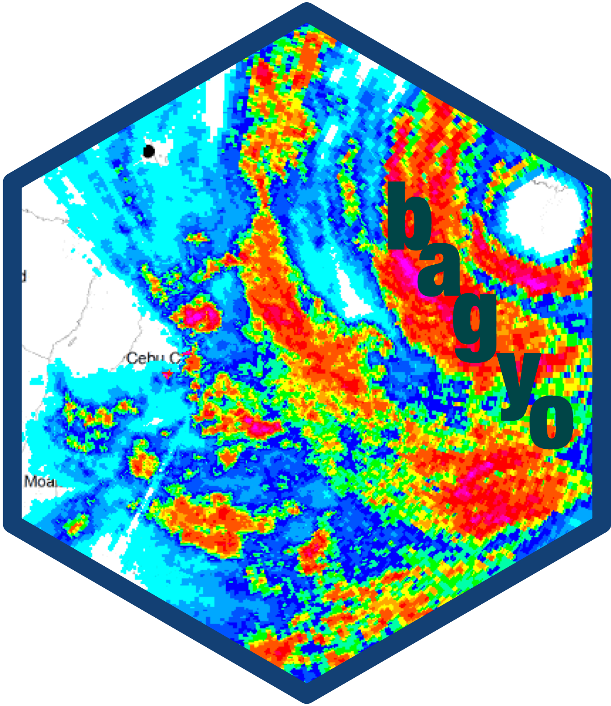

<!-- README.md is generated from README.Rmd. Please edit that file -->

# bagyo: Philippine Tropical Cyclones Data 

<!-- badges: start -->

[](https://www.repostatus.org/#wip)
[](https://lifecycle.r-lib.org/articles/stages.html#experimental)
<!-- badges: end -->

Oceans and seas significantly impact continental weather, with
evaporation from the sea surface driving cloud formation and
precipitation. Tropical cyclones, warm-core low-pressure systems, form
over warm oceans where temperatures exceed 26°C, fueled by the release
of latent heat from condensation. These cyclones, known by various names
depending on the region, have organized circulations and develop
primarily in tropical and subtropical waters, except in regions with
cooler sea surface temperatures and high vertical wind shears. They
reach peak intensity over warm tropical waters and weaken upon landfall,
often causing extensive damage before dissipating.

The Philippines frequently experiences tropical cyclones (called
**bagyo** in the Filipino language) because of its geographical
position. These cyclones typically bring heavy rainfall, leading to
widespread flooding, as well as strong winds that cause significant
damage to human life, crops, and property. Data on cyclones are
collected and curated by the Philippine Atmospheric, Geophysical, and
Astronomical Services Administration (PAGASA) and made available through
its website. This package contains Philippine Tropical Cyclone data in a
machine-readable format. It is hoped that this data package provides an
interesting and unique dataset for data exploration and visualisation.

## Installation

`bagyo` is not yet on CRAN but can be installed from the [panukatan R
universe](https://panukatan.r-universe.dev) as follows:

``` r
install.packages(
  "bagyo",
  repos = c('https://panukatan.r-universe.dev', 'https://cloud.r-project.org')
)
```

## Usage

## Citation

If you find the `bagyo` package useful please cite using the suggested
citation provided by a call to the `citation()` function as follows:

``` r
citation("bagyo")
#> To cite bagyo in publications use:
#> 
#>   Ernest Guevarra (2024). bagyo: Philippine Tropical Cyclones Data R
#>   package version 0.0.0.9000 URL https://panukatan.io/bagyo/
#> 
#> A BibTeX entry for LaTeX users is
#> 
#>   @Manual{,
#>     title = {bagyo: Philippine Tropical Cyclones Data},
#>     author = {{Ernest Guevarra}},
#>     year = {2024},
#>     note = {R package version 0.0.0.9000},
#>     url = {https://panukatan.io/bagyo/},
#>   }
```

## Community guidelines

Feedback, bug reports and feature requests are welcome; file issues or
seek support [here](https://github.com/panukatan/bagyo/issues). If you
would like to contribute to the package, please see our [contributing
guidelines](https://panukatan.io/bagyo/CONTRIBUTING.html).

This project is released with a [Contributor Code of
Conduct](https://panukatan.io/bagyo/CODE_OF_CONDUCT.html). By
participating in this project you agree to abide by its terms.
