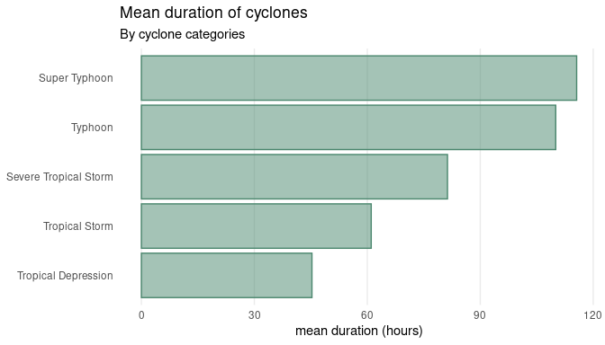

<!-- README.md is generated from README.Rmd. Please edit that file -->

# bagyo: Philippine Tropical Cyclones Data 

<!-- badges: start -->

[](https://www.repostatus.org/#active)
[](https://lifecycle.r-lib.org/articles/stages.html#stable)
[](https://CRAN.R-project.org/package=bagyo)
[](https://cran.r-project.org/web/checks/check_results_bagyo.html)
[](https://CRAN.R-project.org/package=bagyo)
[](https://cran.r-project.org/package=bagyo)
[](https://cran.r-project.org/package=bagyo)
[](https://github.com/panukatan/bagyo/actions/workflows/R-CMD-check.yaml)
[](https://github.com/panukatan/bagyo/actions/workflows/rhub.yaml)
[](https://github.com/panukatan/bagyo/actions/workflows/test-coverage.yaml)
[](https://app.codecov.io/gh/panukatan/bagyo?branch=main)
[](https://www.codefactor.io/repository/github/panukatan/bagyo)
[](https://zenodo.org/doi/10.5281/zenodo.10972234)
[](https://doi.org/10.32614/CRAN.package.bagyo)
<!-- badges: end -->

Oceans and seas significantly impact continental weather, with
evaporation from the sea surface driving cloud formation and
precipitation. Tropical cyclones, warm-core low-pressure systems, form
over warm oceans where temperatures exceed 26°C, precipitated by the
release of latent heat from condensation. These cyclones, known by
various names depending on the region, have organised circulations and
develop primarily in tropical and subtropical waters, except in regions
with cooler sea surface temperatures and high vertical wind shears. They
reach peak intensity over warm tropical waters and weaken upon landfall,
often causing extensive damage before dissipating.

The Philippines frequently experiences tropical cyclones (called
***bagyo*** - pronounced /baɡˈjo/, \[bɐɡˈjo\] - in the Filipino
language) because of its geographical position. These cyclones typically
bring heavy rainfall, leading to widespread flooding, as well as strong
winds that cause significant damage to human life, crops, and property.
Data on cyclones are collected and curated by the [Philippine
Atmospheric, Geophysical, and Astronomical Services Administration
(PAGASA)](https://www.pagasa.dost.gov.ph/).

This package contains Philippine tropical cyclones data from 2017 to
2020 in a machine-readable format. It is hoped that this data package
provides an interesting and unique dataset for data exploration and
visualisation as an adjunct to the traditional
[`iris`](https://stat.ethz.ch/R-manual/R-devel/library/datasets/html/iris.html)
dataset and to the current
[`palmerpenguins`](https://allisonhorst.github.io/palmerpenguins/)
dataset.

## Installation

You can install `bagyo` from [CRAN](https://cran.r-project.org) with:

``` r
install.packages("bagyo")
```

You can install the development version of `bagyo` from the [panukatan
r-universe](https://panukatan.r-universe.dev) with:

``` r
install.packages(
  "bagyo",
  repos = c('https://panukatan.r-universe.dev', 'https://cloud.r-project.org')
)
```

Once the `bagyo` package has been installed, the `bagyo` dataset can be
loaded into R as follows:

``` r
library(bagyo)
data(package = "bagyo")

bagyo
#> # A tibble: 101 × 9
#>     year category_code category_name         name  rsmc_name start              
#>    <dbl> <fct>         <fct>                 <chr> <chr>     <dttm>             
#>  1  2017 TD            Tropical Depression   Auri… <NA>      2017-01-07 08:00:00
#>  2  2017 TD            Tropical Depression   Bisi… <NA>      2017-02-03 14:00:00
#>  3  2017 TD            Tropical Depression   Cris… <NA>      2017-04-14 14:00:00
#>  4  2017 TS            Tropical Storm        Dante Muifa     2017-04-26 08:00:00
#>  5  2017 STS           Severe Tropical Storm Emong Nanmadol  2017-07-02 02:00:00
#>  6  2017 TD            Tropical Depression   Fabi… Roke      2017-07-22 02:00:00
#>  7  2017 TY            Typhoon               Gorio Nesat     2017-07-25 14:00:00
#>  8  2017 TS            Tropical Storm        Huan… Haitang   2017-07-30 02:00:00
#>  9  2017 STS           Severe Tropical Storm Isang Hato      2017-08-20 08:00:00
#> 10  2017 TS            Tropical Storm        Joli… Pakhar    2017-08-24 14:00:00
#> # ℹ 91 more rows
#> # ℹ 3 more variables: end <dttm>, pressure <int>, speed <int>
```

## Usage

### `bagyo` is interesting to summarise

``` r
library(dplyr)

## Get cyclone category mean pressure and speed ----
bagyo |>
  group_by(category_name) |>
  summarise(
    n = n(),
    mean_pressure = mean(pressure), 
    mean_speed = mean(speed)
  )
#> # A tibble: 5 × 4
#>   category_name             n mean_pressure mean_speed
#>   <fct>                 <int>         <dbl>      <dbl>
#> 1 Tropical Depression      27          995.       39.3
#> 2 Tropical Storm           29          987.       58.8
#> 3 Severe Tropical Storm    17          979.       72.6
#> 4 Typhoon                  23          943.       99.1
#> 5 Super Typhoon             5          907       113
```

### `bagyo` is useful in learning how to work with dates

``` r
## Get cyclone category mean duration (in hours) ----
bagyo |>
  mutate(duration = end - start) |>
  group_by(category_name) |>
  summarise(mean_duration = mean(duration))
#> # A tibble: 5 × 2
#>   category_name         mean_duration  
#>   <fct>                 <drtn>         
#> 1 Tropical Depression    45.29630 hours
#> 2 Tropical Storm         61.03448 hours
#> 3 Severe Tropical Storm  81.29412 hours
#> 4 Typhoon               110.04348 hours
#> 5 Super Typhoon         115.60000 hours
```

### `bagyo` is great to visualise




## Citation

If you find the `bagyo` package useful please cite using the suggested
citation provided by a call to the `citation()` function as follows:

``` r
citation("bagyo")
#> To cite bagyo in publications use:
#> 
#>   Ernest Guevarra (2024). _bagyo: Philippine Tropical Cyclones Data_.
#>   doi:10.5281/zenodo.10972235
#>   <https://doi.org/10.5281/zenodo.10972235>, R package version 0.1.1,
#>   <https://panukatan.io/bagyo/>.
#> 
#> A BibTeX entry for LaTeX users is
#> 
#>   @Manual{,
#>     title = {bagyo: Philippine Tropical Cyclones Data},
#>     author = {{Ernest Guevarra}},
#>     year = {2024},
#>     note = {R package version 0.1.1},
#>     url = {https://panukatan.io/bagyo/},
#>     doi = {10.5281/zenodo.10972235},
#>   }
```

## Community guidelines

Feedback, bug reports and feature requests are welcome; file issues or
seek support [here](https://github.com/panukatan/bagyo/issues). If you
would like to contribute to the package, please see our [contributing
guidelines](https://panukatan.io/bagyo/CONTRIBUTING.html).

This project is released with a [Contributor Code of
Conduct](https://panukatan.io/bagyo/CODE_OF_CONDUCT.html). By
participating in this project you agree to abide by its terms.

<br> <br>
